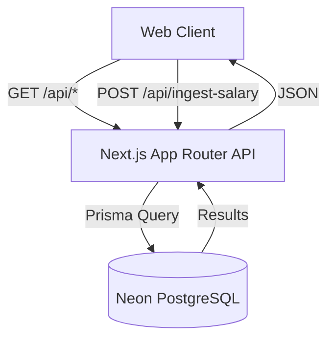

# TalentDash

TalentDash is a compensation intelligence platform — India-first, global by design. Built strictly according to the 3-Day Engineering Trial requirements.

## Architecture & Data Flow

This application is built as a complete, end-to-end integration:



### Key Engineering Decisions:
- **Server Components (RSC) vs Client**: `/salaries` uses React Server Components combined with a thin client wrapper to manage URL search params and Suspense. This minimizes the JS bundle size.
- **Static Generation & ISR**: `/companies/[slug]` leverages `generateStaticParams` to build company pages at compile time for maximum speed. We use ISR (`revalidate: 3600`) so that new salary data ingested over time eventually updates the static pages without requiring a full redeployment.
- **Strict Server Math**: Total compensation is strictly computed on the server side (`base + bonus + stock`). Client payloads for `total_compensation` are completely ignored for data integrity.
- **Normalization**: Company names are heavily normalized on ingestion (lowercased, trimmed, and trailing punctuation stripped) to prevent fragmentation (e.g., "Google Inc." -> "google").
- **Enum Level Standard**: The database strictly uses a native Postgres Enum for the `level` field, mapped appropriately across the API boundary to satisfy both Prisma and API contract requirements (e.g. `SDE_I` vs `SDE-I`).
- **Tailwind Only**: Built strictly using pure Tailwind CSS. Zero external component libraries (No ShadCN, MUI, etc).

## Local Setup

1. **Clone & Install**
   ```bash
   git clone <repo>
   cd talentdash
   npm install
   ```

2. **Environment Variables**
   Copy `.env.example` to `.env` and fill in your Neon DB connection string.
   ```bash
   cp .env.example .env
   ```
   **Required Env Vars:**
   - `DATABASE_URL`: Connection string to your PostgreSQL database. Must end with `?sslmode=require` if using Neon.

3. **Database Migration & Seeding**
   ```bash
   npx prisma generate
   npx prisma db push
   npx prisma db seed  # Generates 85 realistic records across major Indian tech firms
   ```

4. **Run Dev Server**
   ```bash
   npm run dev
   ```

## API Documentation & Examples

### `GET /api/salaries`
Query the salary database. Filterable, sortable, paginated.
**Query Params:** `company`, `role`, `level`, `location`, `sort`, `order`, `page`, `limit`
```bash
# Success
curl -X GET "http://localhost:3000/api/salaries?company=google&limit=5"

# Failure (Invalid pagination limits)
curl -X GET "http://localhost:3000/api/salaries?limit=5000"
# Returns 400: limit must be <= 100
```

### `GET /api/companies/[slug]`
Get aggregated stats and salaries for a specific company, including a server-computed median TC and level distribution.
```bash
# Success
curl -X GET http://localhost:3000/api/companies/google

# Failure (Not found)
curl -X GET http://localhost:3000/api/companies/doesnotexist
# Returns 404
```

### `POST /api/ingest-salary`
Submit a new salary record. Validates all inputs and strictly checks for duplicates.
```bash
# Success
curl -X POST http://localhost:3000/api/ingest-salary \
  -H "Content-Type: application/json" \
  -d '{
    "company": "Google",
    "role": "Software Engineer",
    "level": "L4",
    "location": "Bangalore",
    "experience_years": 3,
    "base_salary": 3200000,
    "bonus": 400000,
    "stock": 800000
  }'

# Failure (Invalid Level / Missing Base Salary)
curl -X POST http://localhost:3000/api/ingest-salary \
  -H "Content-Type: application/json" \
  -d '{
    "company": "Google",
    "role": "Software Engineer",
    "level": "Senior SWE", 
    "location": "Bangalore"
  }'
# Returns 400: Validation Failed (Level must be L3/L4..., Base salary required)
```
